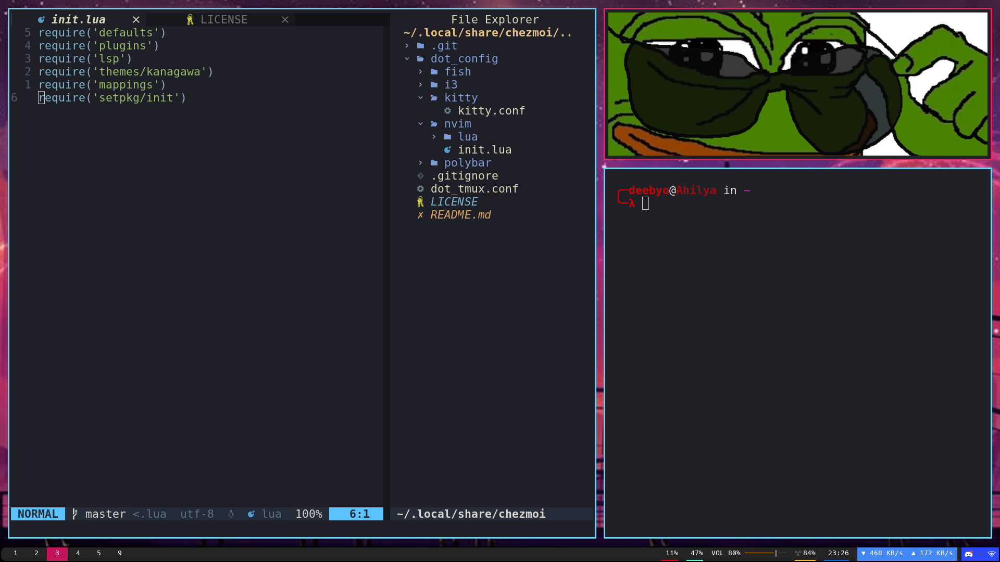

# dotfiles

I am very superstitious about my dotfiles.

## Installation

To install the dotfiles in your computer, you need [chezmoi](https://www.chezmoi.io/)

Install the dotfiles using:
```bash
sh -c "$(curl -fsLS chezmoi.io/get)" -- init --apply
```

## Current status


